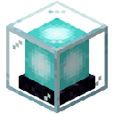

# Invisible Beacon

Changes how tinted glass interacts with beacon beams.

- Tinted glass does not stop the beacon (unlike vanilla Minecraft).
- Placing tinted glass above a beacon makes the beam invisible above the glass.
- The beam remains visible below the tinted glass.

